<div align="center">
  
</div>

---

## $ whoami

```yaml
profile:
  name: "Ing. Alejandro González Aragón"
  role: "Desarrollador Junior"
  organization: "B DRIVE-IT"
  focus: "Automatización · Soporte TI · Ciberseguridad"
  status: "Construyendo proyectos y fortaleciendo mis habilidades"
```

## $ cat tech-stack.yaml

```yaml
programación:
  - Python
  - JavaScript
  - Google Apps Script

herramientas:
  - Git
  - GitHub
  - ITSM / ITIL v4

infraestructura:
  - Redes y diagnóstico de conectividad
```

## $ experience

- Ingeniero de Mesa de Servicio en **B DRIVE-IT**.
- Automatización de procesos y generación de reportes con Python, JavaScript y Google Apps Script.
- Soporte a usuarios, gestión de incidencias, documentación y cumplimiento de SLA.

## $ connect --linkedin

<a href="https://www.linkedin.com/in/alejandrogonzalezaragon">
  
</a>

---

<sub>Perfil construido con GitHub README.</sub>
